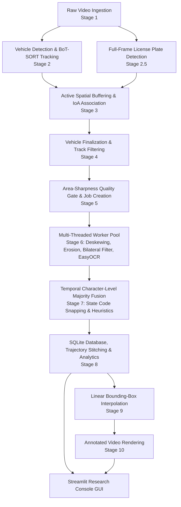

# 🚗 Automatic License Plate Recognition (ALPR) & Vehicle Tracking Pipeline

[](https://www.python.org/)
[](https://pytorch.org/)
[](https://docs.ultralytics.com/)
[](https://github.com/JaidedAI/EasyOCR)
[](https://streamlit.io/)
[](#)

A high-performance, multi-stage **Automatic License Plate Recognition (ALPR)** and **Vehicle Tracking** pipeline engineered for high-accuracy vehicle identification, trajectory tracking, plate localization, optical character recognition (OCR), and temporal multi-frame voting.

---

## 📑 Table of Contents

- [Overview](#-overview)
- [System Architecture](#-system-architecture)
- [Detailed 10-Stage Pipeline](#-detailed-10-stage-pipeline)
- [Key Technical Highlights & Algorithms](#-key-technical-highlights--algorithms)
- [Directory & File Structure](#-directory--file-structure)
- [Installation & Setup](#-installation--setup)
- [Configuration & Hyperparameters](#-configuration--hyperparameters)
- [How to Run](#-how-to-run)
- [Streamlit Research Console](#-streamlit-research-console)
- [Output Artifacts & Data Schema](#-output-artifacts--data-schema)
- [Contributing & License](#-contributing--license)

---

## 🌟 Overview

Recognizing license plates from traffic cameras in complex real-world conditions presents several challenges: rapid vehicle motion, motion blur, varying lighting, skewed camera angles, occlusions, and non-standard or multi-line plates. 

This ALPR pipeline addresses these challenges through a modular, multi-threaded, asynchronous processing architecture. Rather than relying on single-frame OCR, the system leverages continuous spatial-temporal tracking, native-resolution plate detection, intelligent sharpness-aware frame selection, morphological stroke enhancement, and confidence-weighted character voting across time.

---

## 🏗️ System Architecture



---

## 🔬 Detailed 10-Stage Pipeline

### Stage 1: Frame Ingestion (`stage1_frame_ingestion.py`)
- **Function**: Decodes video frames via OpenCV with asynchronous multi-threaded queueing.
- **Key Details**: Streams frames at full native resolution ($1080\text{p}/4\text{K}$) to prevent downsampling artifacts and preserve fine character stroke details. Produces structured `(frame, frame_idx, timestamp)` tuples.

### Stage 2: Vehicle Detection & Tracking (`stage2_detection_tracking.py`)
- **Function**: Identifies vehicles and maintains persistent track IDs across frames.
- **Technology**: YOLOv8 vehicle detector coupled with the **BoT-SORT** tracker (`tracker="botsort.yaml"`).
- **Key Details**: Employs appearance-based matching (ReID) and Kalman filtering to maintain track continuity across sudden speed changes, camera panning, and transient occlusions. Applies inverse coordinate scaling to project detection boxes back to native frame dimensions.

### Stage 2.5: Full-Frame Plate Detection (`plate_detection.py`)
- **Function**: Detects license plates at native frame resolution.
- **Key Details**: Runs once per frame at full scale rather than on cropped vehicle snippets. Filters candidate detections by aspect ratio ($1.10 \le \text{AR} \le 5.5$) and confidence thresholds ($\ge 0.30$) to reject square QR codes and non-plate bodywork.

### Stage 3: Active Spatial Buffering (`stage3_active_buffering.py`)
- **Function**: Accumulates vehicle history and pairs plates with vehicles in real-time.
- **Association Metric**: **Intersection-over-Area ($\text{IoA} \ge 0.35$)** associates full-frame plate detections with expanded vehicle bounding boxes. Stores lightweight vehicle regions-of-interest (ROIs) with configurable padding.

### Stage 4: Vehicle Finalization (`stage4_vehicle_finalization.py`)
- **Function**: Finalizes vehicle tracks when a vehicle leaves the camera frame or reaches tracking timeout.
- **Quality Gates**: Rejects spurious false-positive tracks ($<3$ frames) and tracks with anomalous bounding box variance.

### Stage 5: Sharpness & Area-Aware Job Creation (`stage5_job_creation.py`)
- **Function**: Selects the highest quality frames for OCR and packages them into worker jobs.
- **Scoring Formula**:
  $$\text{Score} = \sqrt{\text{Plate Bounding Box Area}} \times \text{Laplacian Variance (Sharpness)} \times \text{Confidence}$$
- **Key Details**: Prioritizes frames where the vehicle is closest to the camera with minimal motion blur, selecting the top-$k$ frames ($k=20$).

### Stage 6: Multi-Threaded Worker Pool & OCR (`stage6_worker_pool.py`)
- **Function**: Asynchronously preprocesses plate crops and performs Optical Character Recognition.
- **Image Enhancement**:
  1. **Geometric Deskewing**: Rectifies angled/skewed license plates via perspective transformation.
  2. **Bilateral Filtering**: Smooths noise while preserving high-contrast character edges ($d=11, \sigma=17$).
  3. **Morphological Character Erosion**: Thins character strokes to prevent character mergers and confusion between `M`, `N`, and `H`.
  4. **Lanczos4 Super-Sampling**: Upscales plate crops for enhanced OCR character separation.
  5. **Canny Edge Density Verification**: Drops non-text bodywork crops ($\text{Density} < 0.02$).
- **OCR Engine**: EasyOCR engine with multi-line vertical bounding-box merging (supporting stacked 2-line Indian plates) and soft positional format correction.

### Stage 7: Temporal Character-Level Majority Fusion (`stage7_temporal_fusion.py`)
- **Function**: Combines multiple independent OCR readings from the same vehicle into a single consensus string.
- **Voting Mechanism**: Confidence-weighted character-level majority voting per string index.
- **State Code Snapping**: Incorporates a dictionary of all 36 Indian States and Union Territories with Levenshtein-distance fuzzy snapping ($\le 1$ edit distance).

### Stage 8: Database Persistence & Analytics (`stage8_database_analytics.py`)
- **Function**: Persists final vehicle tracks, OCR readings, and confidence metrics to SQLite (`results.db`).
- **Trajectory Stitching**: Plate-guided post-tracking stitching unifies fragmented trajectories sharing the same plate within a 300-frame temporal window.

### Stage 9: Bounding-Box Interpolation (`stage9_interpolation.py`)
- **Function**: Fills detection gaps in vehicle trajectories.
- **Algorithm**: Multi-dimensional linear interpolation (`scipy.interpolate.interp1d`) ensures smooth, jitter-free bounding box tracks across missed frames.

### Stage 10: High-Definition Visualization (`stage10_visualize.py`)
- **Function**: Renders the final annotated video (`annotated_output.mp4`).
- **Visual Features**: Vehicle bounding boxes, persistent track IDs, recognized license plate text badges, confidence scores, and picture-in-picture zoomed plate crops.

---

## ⚡ Key Technical Highlights & Algorithms

| Feature | Description |
| :--- | :--- |
| **BoT-SORT Tracker** | Uses Camera Motion Compensation (CMC) and deep ReID feature appearance matching for consistent vehicle IDs. |
| **Full-Frame Plate Localization** | Eliminates crop-coordinate drift and preserves maximum pixel density for distant vehicles. |
| **Soft Positional Correction** | Heuristic layout mapping for Indian plates (`SS DD L{1,3} DDDD`), correcting digit/letter confusions non-destructively. |
| **Two-Line Plate Assembly** | Vertically orders and merges multi-row license plates while filtering out holographic `IND` badges. |
| **Stroke Erosion Filter** | Morphological kernel erosion preserves internal white space in dense letterforms like `M`, `H`, and `N`. |
| **Multi-Frame Majority Voting** | Eliminates single-frame glare or occlusion errors by voting across up to 20 candidate frames. |
| **Plate-Guided Trajectory Stitching**| Recombines split track IDs belonging to the same vehicle during long occlusion intervals. |

---

## 📁 Directory & File Structure

```text
CapstoneProject/
├── GUI/
│   └── app.py                     # Streamlit Research & Operations Console
├── dataset/
│   └── test2.mp4                  # Sample input video
├── models/
│   ├── best.pt                    # Fine-tuned YOLO License Plate weights
│   └── yolov8s.pt                 # YOLOv8 Vehicle Detection weights
├── config.py                      # Central configuration, paths & hyperparameters
├── main_pipeline.py               # Main pipeline execution orchestrator
├── pipeline_metrics.py            # Performance benchmarking & metrics calculator
├── plate_detection.py             # Stage 2.5: Full-frame plate detection stage
├── plate_utils.py                 # Geometric deskewing, filters, format heuristics
├── stage1_frame_ingestion.py      # Stage 1: Threaded video decoding
├── stage2_detection_tracking.py   # Stage 2: Vehicle detection & BoT-SORT tracking
├── stage3_active_buffering.py     # Stage 3: Trajectory buffering & IoA matching
├── stage4_vehicle_finalization.py # Stage 4: Track validation & quality gates
├── stage5_job_creation.py         # Stage 5: Laplacian sharpness & job queue
├── stage6_worker_pool.py          # Stage 6: Multi-threaded OCR worker pool
├── stage7_temporal_fusion.py      # Stage 7: Confidence-weighted character voting
├── stage8_database_analytics.py   # Stage 8: SQLite database & trajectory stitching
├── stage9_interpolation.py        # Stage 9: Trajectory interpolation
├── stage10_visualize.py           # Stage 10: Video annotation & rendering
├── requirements.txt               # Project dependencies
├── changes.md                     # Architecture update log & reversion guide
├── progress.md                    # Detailed progress audit & benchmark history
└── README.md                      # Project documentation
```

---

## 🚀 Installation & Setup

### 1. Clone the Repository
```bash
git clone https://github.com/Anshul23704/CapstoneProject.git
cd CapstoneProject
```

### 2. Set Up a Virtual Environment
```bash
python3 -m venv .venv
source .venv/bin/activate    # On Windows: .venv\Scripts\activate
```

### 3. Install Dependencies
```bash
pip install --upgrade pip
pip install -r requirements.txt
```

> **Note**: For Streamlit GUI auto-refresh capabilities, install:
> ```bash
> pip install streamlit-autorefresh python-dotenv
> ```

### 4. Verify Model Weights
Ensure model weights are present in the `models/` directory:
- `models/best.pt` or `models/license_plate_yolo26m-3/weights/best.pt`
- `yolov8s.pt` (will be downloaded automatically by Ultralytics if missing)

---

## ⚙️ Configuration & Hyperparameters

All pipeline settings are centralized in [`config.py`](config.py) and can be configured directly or overridden via environment variables:

```python
# Hardware Acceleration (Automatic detection: CUDA -> MPS -> CPU)
DEVICE = "cuda" | "mps" | "cpu"

# Vehicle Classes (COCO ID 2 = Car)
VEHICLE_CLASS_IDS = {2}

# Tracker Settings (BoT-SORT)
TRACK_BUFFER = 90             # Max frames to keep lost tracks alive
TRACK_MATCH_THRESHOLD = 0.45  # Matching threshold for tracking

# Plate Detection & Association
PLATE_CONF_THRESHOLD = 0.30   # Minimum plate detector confidence
PLATE_VEHICLE_IOA_THRESHOLD = 0.35  # Min Intersection-over-Area for vehicle matching
MIN_PLATE_ASPECT_RATIO = 1.10 # Allows 2-line plates while filtering square stickers
MAX_PLATE_ASPECT_RATIO = 5.50

# Worker Pool & Quality Gate
TOP_K_FRAMES = 20             # Max sharpest frames selected per vehicle
BLUR_THRESHOLD = 80.0         # Minimum Laplacian variance
NUM_WORKERS = 3               # Concurrent OCR worker threads
```

---

## 💻 How to Run

### Run the Complete Pipeline
Execute the full 10-stage pipeline on the default video source:
```bash
python main_pipeline.py
```

To specify a custom video source or model weights via environment variables:
```bash
VIDEO_SOURCE="path/to/traffic_video.mp4" python main_pipeline.py
```

### Run the Interactive GUI
Launch the Streamlit dashboard to inspect runs, view live metrics, and review plate crops:
```bash
streamlit run GUI/app.py
```

---

## 🖥️ Streamlit Research Console

The included Streamlit console (`GUI/app.py`) provides an interactive interface for:
- **Run Discovery & Telemetry**: Automatically detects run directories in `output/` and displays processing timestamps, frame counts, and hardware usage.
- **High-Confidence Plate Inspector**: Review high-confidence recognized plates with side-by-side cropped plate images and vehicle context bounding boxes.
- **Trajectory & Plate Analysis**: Filter vehicles by track ID, frame range, or confidence score.
- **Interactive Video Player**: Play back the rendered `annotated_output.mp4` directly inside the browser.
- **Export Center**: Download structured CSV reports (`Final_outputs.csv`, `results_rich.csv`) and the SQLite database.

---

## 📊 Output Artifacts & Data Schema

Each pipeline execution produces a timestamped folder inside `output/<YYYYMMDD_HHMMSS>/`:

| Artifact | Format | Description |
| :--- | :--- | :--- |
| `Final_outputs.csv` | CSV | Final high-confidence aggregated vehicle plate results with timestamps and scores. |
| `results_rich.csv` | CSV | Raw frame-by-frame vehicle tracking and OCR readings. |
| `results_rich_interpolated.csv` | CSV | Full trajectory data with smoothed bounding boxes. |
| `results_raw_detections.csv` | CSV | Frame-by-frame plate detection coordinates. |
| `results.db` | SQLite | Persistent relational database storing tracks and plate recognitions. |
| `pipeline_metrics.md` | Markdown | Comprehensive execution statistics, throughput, and accuracy metrics. |
| `annotated_output.mp4` | MP4 | Rendered output video with bounding boxes, tracking IDs, and OCR overlays. |
| `plate_crops/` | PNGs | Exported enhanced plate crops (`*_plate.png`) and vehicle context images (`*_context.png`). |

---

## 📜 License

This project is developed as part of an Engineering Capstone. Distributed under the MIT License.
